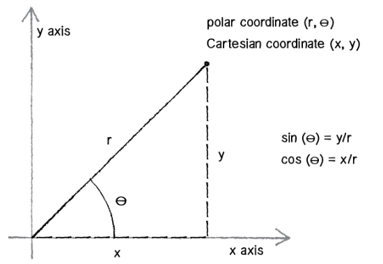

# Lab 918::Angular Motion#

###Objectives###
 - Remember **radians** and **degrees**
 - Use **save()** and **restore()** with transformations
 - Understand **Angular** **velocity** and **Angular****acceleration**
 - Create an **orbiter object** that will orbit a boid object
 

###Part I: Remember Radians?###

 - We can measure angles in different ways.  In PreCalc? you were introduced to radian measure. Radians give angle measure in terms of PI.   Half way around a circle is equal to PI radians.  So we can say 180 degrees is equal to PI radians.  It turns out that most trigonometric functions in the Math class are goining to take paremeters and offer return values in terms of radians.

 

##Part II: Save and Restore##

 -  There are three transformations we will be using in JavaScript: **translate**, **rotate** and **scale**
 -  Whenever we rotate in JavaScript, we ALWAYS rotate around the origin (upper left corner by default).  However this is most often not what we want.  The good news is we can use translate to move the origin to any location and rotate around that location.  In order to do this, we need to save the current coordinate system and then restore it after we are done.

		save()
			translate(this.loc.x, this.loc.y);
			rotate(someAngle);
		restore()

  
##Part III: Add angular velocity and acceleration##

 - From Shiffman:

		location = location + velocity
		velocity = velocity + acceleration
 
		angle = angle + angular velocity
		angular velocity = angular velocity + angular acceleration

 -  Most often, math functions will take radian measure instead of degree measure
   

##Part IV: Create an orbiter Constructor function##

  -  An orbiter will rotate around a boid object.  Each boid will use the orbiter constructor function to create and array of orbiters.  In other words, the orbiter array will be a property of the boid object.
  -   Orbiters will rotate around the boid that contains them
  -  Your boids will be triangles and your orbiter should be round.
 
----

