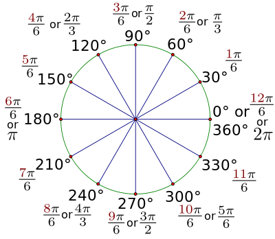

# Lab 919::Collision Detection#

###Objectives###
 - Remember **Radians**
 - Use **save()** and **restore()** with transformations
 - Use the p5 function **lerp()**
 - Make a **boid constructor function**
 - Use the Vector method **dist()** to check for collision
 - **Splice** boids out of the boids array
 
##Part I: Radians and degrees##

 - Most Math functions will take in and return radian values rather than degree values.  Radians determin the measure of an angle in terms of PI (3.14159...)

##Part II: Save and Restore##

 -  There are three transformations we will be using in p5.js: **translate**, **rotate** and **scale**
 -  Whenever we rotate in JavaScript, we ALWAYS rotate around the origin (upper left corner by default).  However this is most often not what we want.  The good news is we can use translate to move the origin to any location and rotate around that location.  In order to do this, we need to save the current coordinate system and then restore it after we are done. p5 has two functions that help us accomplish this:  **push()** and **pop()**

		push() // push or save the current coord system into the stack
			translate(this.loc.x, this.loc.y);
			rotate(someAngle);
            triangle(-5, 0, 5, 0, 0, -15);
		pop()  //  pop or restore the coordianate system from the stack

  
##Part III: Lerp your mouse##

 - Lerp is short for linear interpolation.  Essentially it moves one thing toward another in a way the is prettier
 - **Description:** Lerp calculates a number between two numbers at a specific increment. The amt parameter is the amount to interpolate between the two values: start and stop

 - **Syntax**
 
 			lerp(start, stop, amt)
		

 -  We can use this with the our **ball** location and the location of the **mouse** as our start and stop positions.  **mouseX** and **mouseY** are **p5** values that give the location of the mouse at any moment during the run of the program.  First create a vector for the location of the mouse, then lerp between the ball location and the mouse location

		var mouseLoc = createVector(mouseX, mouseY);
    	this.loc = p5.Vector.lerp(this.loc, mouseLoc, .09)

##Part IV: create a Boid class##

 - Make a boid class:  A **boid** object is a triangle that will attempt to flee from a **chaser** object 
 - Decide what properties and methods the boid objects will need and write these into the boid **constructor function**.
 - Make a **boids array** and fill it with as many boids as you like
 - Create a Ball object named **chaser**.
   

##Part V: Check for collsion##

  -  Collision detection is an important part of many games.  We will use collision detection to decide when to remove a boid from the array of boids
  -  Each Vector has many functions.  One of these is **dist()**.  This method will return the distance between two vector objects:
			
			//returns the distance between two objects
			var dist = vector1.dist(vector2); 

##Part VI: Use the splice method to remove boids from an array##

  -  The **splice()** method changes the contents of an array by removing existing elements and/or adding new elements. 

 - Assume you have an array of boids named boids.  To remove an element from the arrray, you can use the following code:

			boids.splice(i, 1)// remove one element at index i

  - How do you know which boids to remove from the boids array?
 
----

